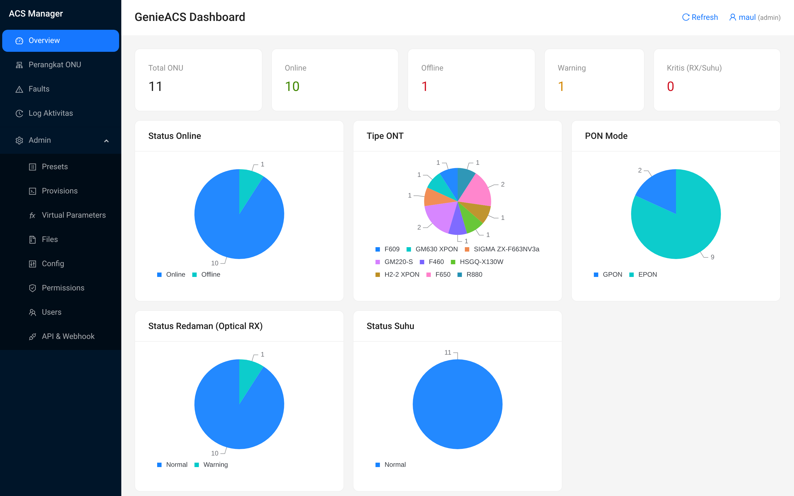
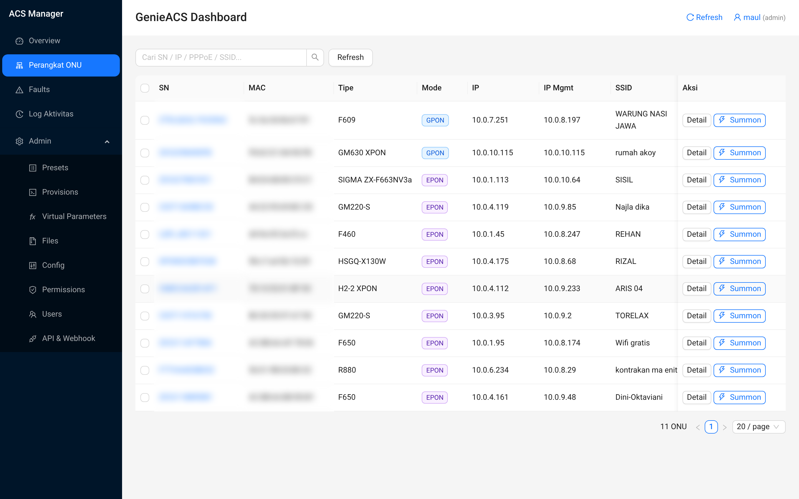
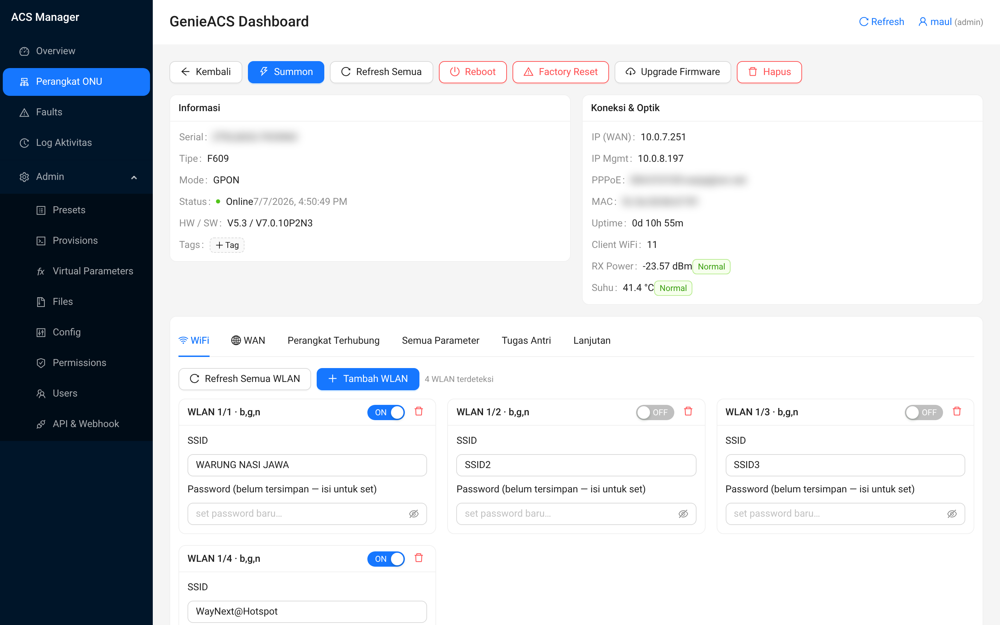
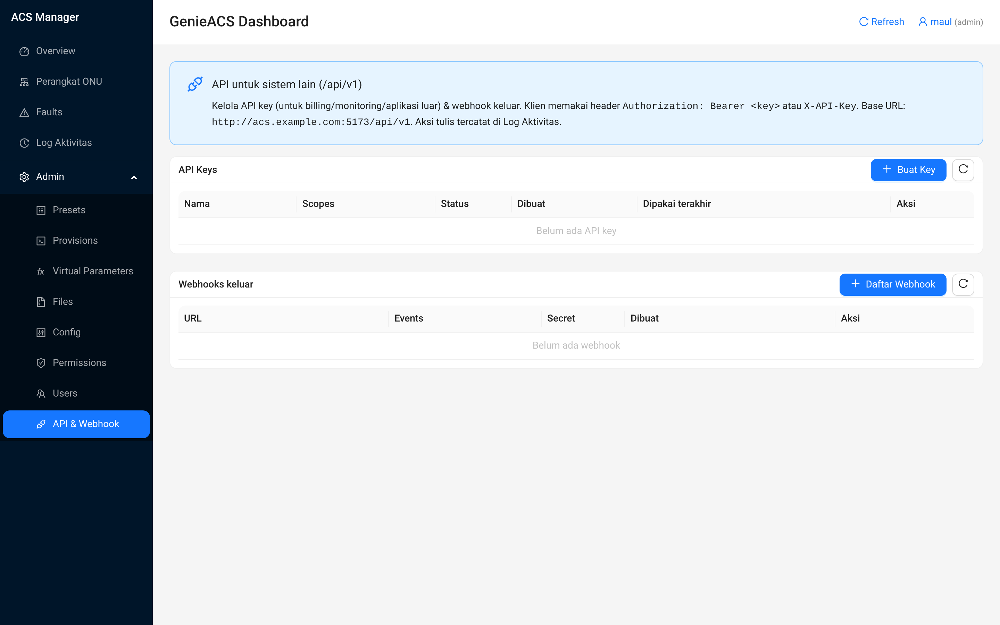

# ACS Manager — GenieACS TR-069 Management Suite

Suite manajemen ONU/ONT berbasis **TR-069 (CWMP)** untuk ISP: provisioning otomatis multi-merek, virtual parameters siap pakai, dan **dashboard web modern (React + Ant Design)** untuk memantau & mengelola ribuan perangkat pelanggan dari satu layar.

Dibangun di atas [GenieACS](https://genieacs.com) (open-source ACS) — ACS Manager menambahkan lapisan provisioning yang tahan banting, virtual parameters multi-vendor, dan dashboard operasional yang siap dipakai NOC/CS.

---

## ✨ Fitur Utama

**Dashboard Operasional**
- **Overview** — statistik armada (online/offline/fault) + grafik (model, redaman/RX power, suhu).
- **Perangkat ONU** — daftar perangkat, pencarian, filter, aksi massal (bulk), tombol Summon (refresh paksa).
- **Detail Perangkat** — parameter lengkap, WiFi (SSID/password), WAN, VLAN, reboot, firmware.
- **WiFi CRUD** — ubah SSID & password per perangkat langsung dari dashboard.
- **WAN & VLAN** — kelola koneksi WAN + VLAN multi-vendor (GPON/EPON/ZTE).
- **Firmware & Files** — kelola file firmware untuk push ke perangkat.
- **Faults** — pantau perangkat bermasalah.

**Multi-tenant / Operasional Tim**
- **RBAC** — role **CS / NOC / Admin** dengan pembatasan menu & aksi (enforce di backend, bukan sekadar UI).
- **Manajemen User** — buat user, atur role, ganti password.
- **Log Aktivitas (Audit)** — catat siapa melakukan apa & kapan.

**Integrasi**
- **REST API `/api/v1`** — API key multi-key + scope (`read`/`write`/`stats`/`webhook`) untuk sistem billing/monitoring/aplikasi lain.
- **Webhook keluar** — notifikasi event (online/offline/fault) dengan tanda tangan **HMAC-SHA256** (`X-ACS-Signature`).
- **UI kelola API key & Webhook** langsung dari dashboard (admin-only).

**Provisioning yang Tahan Banting**
- Provision `inform`/`default` universal — kompatibel lintas merek ONU (GPON/EPON, TR-098/IGD).
- **Virtual Parameters** siap pakai: `RXPower`, `Temperature`, `WANIP`, `WANMAC`, `IPMgmt`, `PPPoEUsername`, `Uptime`, `ClientCount`, `PONMode`, `Model`, `RedamanStatus`, `SuhuStatus`.

---

## 🖼️ Tampilan

Screenshot fitur tersedia di [`docs/screenshots/`](docs/screenshots/). Data sensitif (Serial Number, MAC, PPPoE) sudah disamarkan.

| | |
|---|---|
|  |  |
|  |  |

---

## 🏗️ Arsitektur

```
  ONU/ONT pelanggan ──TR-069/CWMP:7547──►  GenieACS (cwmp/nbi/fs/ui)  ◄── MongoDB
                                                   │  NBI :7557 (localhost)
                                                   ▼
                                          Dashboard React+antd :5173
                                          (proxy /nbi + /api + /api/v1)
                                                   ▲
                       CS / NOC / Admin ───browser─┘   Sistem lain ──API key──► /api/v1
```

- **GenieACS core** berjalan dalam Docker (`docker/`) — 4 service (cwmp, nbi, fs, ui) + MongoDB.
- **Dashboard** (`dashboard-antd/`) — SPA React + Ant Design, proxy ke NBI & menyediakan `/api` (admin) dan `/api/v1` (mesin).
- NBI (`:7557`) & UI bawaan (`:3000`) **dikunci ke localhost** demi keamanan; hanya CWMP (`:7547`) & FS (`:7567`) yang publik untuk perangkat.

---

## 📂 Struktur Repo

| Folder | Isi |
|---|---|
| `provisions/` | Provision scripts universal (bootstrap, default, inform) untuk semua merek ONU |
| `virtual-parameters/` | Virtual Parameters multi-model (RXPower, WANIP, dst.) |
| `ui-config/` | Konfigurasi UI GenieACS (device list, chart overview) |
| `dashboard-antd/` | Dashboard React + Ant Design (lihat `dashboard-antd/README.md`) |
| `docker/` | docker-compose, Dockerfile, entrypoint (tanpa secret) |
| `docs/screenshots/` | Screenshot fitur |
| `summon-all.py` | Utility: summon (refresh) semua ONU sekaligus, sekuensial |

---

## 🚀 Instalasi

Panduan lengkap ada di **[INSTALL.md](INSTALL.md)**. Ringkasnya:

```bash
# 1. GenieACS core (Docker)
cp .env.example .env          # isi GENIEACS_UI_JWT_SECRET dgn string acak
cd docker && docker compose up -d --build

# 2. Import provisions & virtual-parameters ke GenieACS (lihat INSTALL.md)

# 3. Dashboard
cd ../dashboard-antd && npm install && npm run build
# sajikan dist/ via nginx / systemd (contoh di INSTALL.md)
```

---

## 🎨 Rebranding (Whitelabel)

Produk memakai nama default **"ACS Manager"**. Untuk mengganti dengan merek Anda:

- Nama di sidebar & halaman login: cari-ganti string `ACS Manager` di
  `dashboard-antd/src/App.jsx` dan `dashboard-antd/src/pages/Login.jsx`.
- Warna tema utama (`#1677ff`) diatur di konfigurasi Ant Design pada `dashboard-antd/src/main.jsx`.
- Header webhook (`X-ACS-Event`, `X-ACS-Signature`) dapat diubah di `dashboard-antd/ext-api.js`.

---

## 📄 Lisensi

Perangkat lunak komersial — lihat **[LICENSE](LICENSE)**. Bukan open-source; penggunaan tunduk pada perjanjian pembelian.
